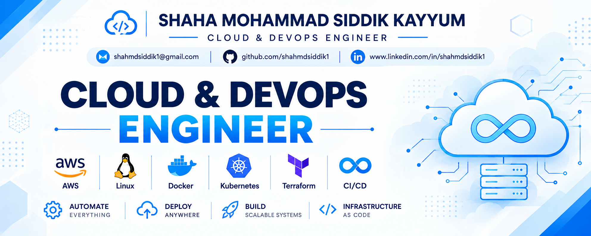

<!-- ============================================= -->

<!--              GITHUB PROFILE README            -->

<!-- ============================================= -->

  

 

<h1 align="center">
  Hi, I'm Shaikh Hujef Majidhusen 👋
</h1>

<h3 align="center">
  Aspiring Cloud & DevOps Engineer | AWS • Linux • Git • Docker • CI/CD • DataOps • Kubernetes • Terraform • GitOps • Hadoop • Cloudera CDP • Impala • Kafka
</h3>

  

  

  

---

## 🚀 About Me

* 🎓 B.Tech Computer Science & Engineering student.
* ☁️ Building my foundation in Cloud Computing and DevOps.
* 🐧 Practicing Linux administration, networking, and troubleshooting.
* 🔧 Working with AWS, Git, GitHub, Bash, Python, Docker, Kubernetes, Terraform, Cloudera CDP, Impala, and Kafka.
* 🚀 Building hands-on projects to understand real-world infrastructure.
* 📚 Learning Infrastructure as Code, CI/CD, containers, and cloud security.
* 🔍 Interested in automation, observability, reliability, and scalable infrastructure.
* 📝 Documenting my Cloud & DevOps learning journey through projects and technical notes.

---

## 🛠️ Tech Stack

### ☁️ Cloud & DevOps

  

### 💻 Programming & Scripting

  

### 🐧 Linux, Git & Development Tools

  

### 🏗️ Infrastructure & Automation

  

### 🔄 CI/CD & GitOps

  

**GitOps • CI/CD Automation • Deployment Workflows**

### 🐘 Big Data & Data Engineering

  

**Hadoop • HDFS • Cloudera CDP • Impala • Kafka**

### ⚙️ DataOps

**DataOps • Data Workflows • Data Automation • Distributed Data Processing**

### 📊 Monitoring & Observability

  

**CloudWatch • Monitoring • Logging • Observability**

---

## 📚 Currently Learning

* ☁️ AWS Cloud Services
* 🐧 Linux & Bash Scripting
* 🌐 Computer Networking
* 🐍 Python for Cloud & DevOps
* 🐳 Docker & Containerization
* 🔄 CI/CD with GitHub Actions
* 🏗️ Terraform & Infrastructure as Code
* ☸️ Kubernet*
